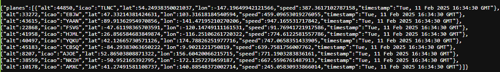
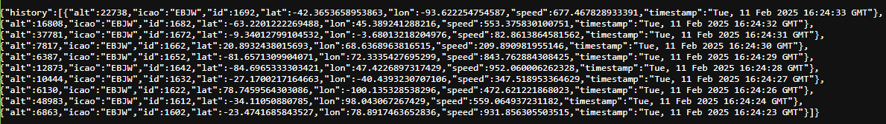

# Drones Tracker Backend

## Description

The Drones Tracker Backend is a Flask application that tracks real-time flight data of planes, including speed, altitude, location (latitude/longitude), and timestamp. It also provides an endpoint to retrieve the flight history of a specific plane.

## Running the Application with Docker

1. **Clone the repository**
   ```bash
   git clone https://github.com/YourRepo.git
   cd drones_tracker_backend
2. **Build the Docker Image and run docker container**
    ```bash
    docker build -t flask-app .
    docker run -p 5000:5000 flask-app
The application will be available at http://localhost:5000.

## Endpoints

- **/planes**: Returns the latest real-time data for a list of planes.

    example: http://localhost:5000/planes
    
- **/planeHistory**: Returns the flight history of a specific plane. You need to provide the `icao` parameter to fetch the history. 

    example: http://localhost:5000/planeHistory?icao=EBJW 
    

## Technologies Used

- **Flask**: Web framework for Python.
- **SQLAlchemy**: ORM for handling database operations.
- **SQLite**: Lightweight database for storing plane data.
